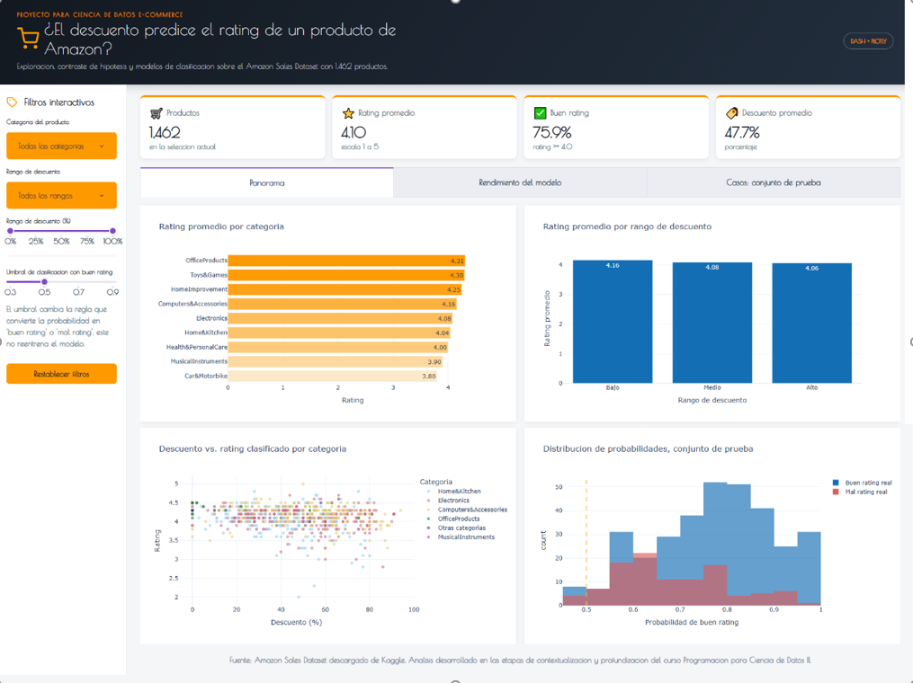
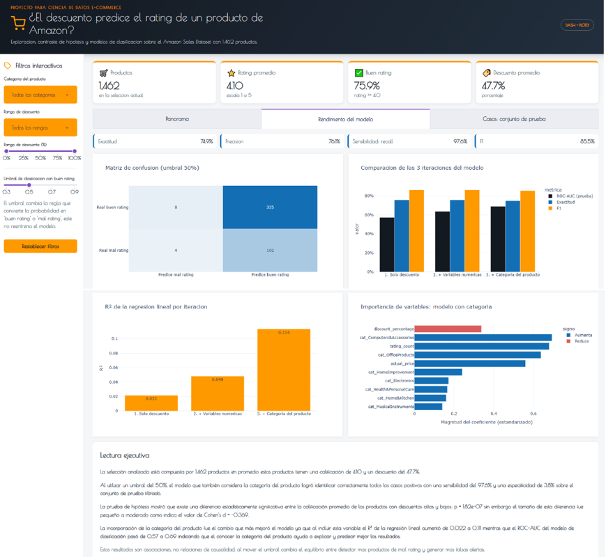
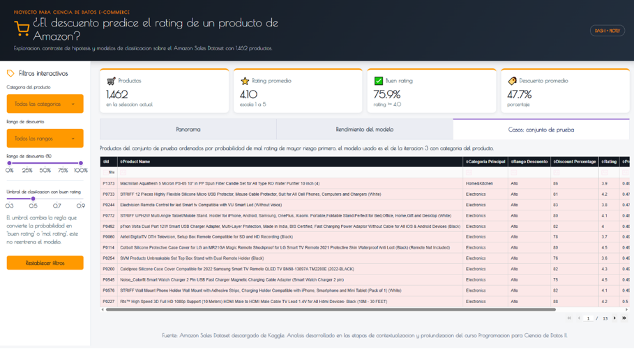

# Dashboard: descuento, categoria y rating en Amazon

Proyecto final de la asignatura Programacion para Ciencia de Datos II.
Presenta, en un dashboard interactivo, los hallazgos del contraste de
hipotesis, la regresion lineal multiple y la regresion logistica
desarrollados sobre el Amazon Sales Dataset descargados de Kaggle.





## Estructura

```text
app.py                       Dashboard Dash
entrenar_modelo.py           Limpieza de datos, 3 iteraciones del modelo y exportacion de resultados
data/amazon.csv              Dataset original descargado de Kaggle
outputs/                     Dataset limpio, predicciones, metricas e importancia (generados)
assets/style.css             Estilos del dashboard (identidad corporativa de Amazon)
tests/test_pipeline.py        Pruebas de integridad de datos y resultados
requirements.txt, environment.yml, Procfile   Configuracion de entorno y despliegue
binder/start                 Arranque del dashboard en Binder
GUIA_ENTREGA.md               Correspondencia entre los archivos y los requerimientos de la actividad
```

## Ejecucion rapida

Requiere Python 3.11 o posterior.

Windows PowerShell:

```powershell
python -m venv .venv
.venv\Scripts\Activate.ps1
pip install -r requirements.txt
python entrenar_modelo.py
python app.py
```

Linux o macOS:

```bash
python -m venv .venv
source .venv/bin/activate
pip install -r requirements.txt
python entrenar_modelo.py
python app.py
```

Abra `http://127.0.0.1:8050` en el navegador.

## Pruebas

```bash
pytest -q
```

## Nota

Los datos provienen de un dataset publico de Kaggle (Amazon Sales Dataset)
Los hallazgos son asociaciones estadisticas, no relaciones de causalidad.
